# StarMould ERP Migration & Parity Audit Report

**Date:** September 25, 2026  
**Repository:** `shubhhh-codes/starmould`  
**Branch:** `migration`  
**Target Architecture:** Next.js 16.3.5 (App Router, Turbopack, React 19) + Supabase PostgreSQL + Tailwind CSS  
**Reference Source:** Legacy Laravel 8+ PHP (`app/`, `routes/`, `resources/views/`, `database/`)

---

## 1. Authentication & RBAC Evidence Matrix

### 1.1. Role Definitions & Hierarchy
| Role ID | Role Name | Legacy Laravel Scope (`topbar.blade.php`, Controllers) | Next.js Gateway (`middleware.ts`) | Next.js API Enforcement (`authenticateRequest`) |
| :--- | :--- | :--- | :--- | :--- |
| **0** | **Admin** | Unrestricted access across all views, user management, expenses, gram pricing, financials, delete operations. | Allowed on all routes (`/` through `/user`). | Allowed on all API endpoints (`[0]` included everywhere). |
| **1** | **Manager** | Full operational access: Purchases, Inward, Challan, Dispatch, Expenses, Customers, Reports, Exports. Excluded from User Management in some views. | Allowed on all routes except `/user` (unless explicitly configured). | Explicitly checked: `[0, 1]` on `/api/customers`, `/api/expense`, `/api/gram`, `/api/purchases`, `/api/purchase-inward`, `/api/export`. |
| **2** | **Supervisor**| Floor operations: Outward Challan, Inward Challan, Dispatch, Printing, Subplate, Scanning, Worklog, Reports. Excluded from Purchases, Expenses, Customers, Gram. | Restricted to `[0, 1, 2]` routes (`/challan`, `/inward`, `/dispatch`, `/printing`, `/report`, `/subplate`, `/scanning`, `/work`). | Allowed on `[0, 1, 2]` endpoints: `/api/challan`, `/api/inward`, `/api/dispatch`, `/api/printing`, `/api/report`. Blocked (403) from `/api/expense`, `/api/purchases`, `/api/gram`. |
| **3** | **Designer** | Technical floor: Live Projects, Subplate Tooling, CAD/CAM stage tracking, personal worklog. Excluded from commercial/logistics modules. | Restricted to `[0, 1, 2, 3]` routes (`/subplate`, `/sample`, `/scanning`, `/work`, `/`). | Allowed on `[0, 1, 2, 3]` endpoints: `/api/subplate`, `/api/sample`, `/api/scanning`, `/api/worklog`. Blocked (403) from `/api/challan`, `/api/printing`, `/api/purchases`. |
| **4** | **Worker** | Machine operator: Live Projects floor status, personal shift work logging (`worklog`). | Restricted to `[0, 1, 2, 3, 4]` routes (`/scanning`, `/work`, `/`). | Allowed on `/api/scanning`, `/api/worklog`, `/api/counts`. In `/api/worklog`, query is strictly scoped to `userid = auth.user.id`. |

### 1.2. Security Mechanisms & Service-Role Isolation
- **Edge Gateway Authentication (`middleware.ts`)**: Cryptographically verifies HMAC-SHA256 signatures (`verifySessionTokenEdge`) via Web Crypto API on the `sm_session` cookie before page execution. Unauthenticated or tampered requests are immediately redirected to `/login`.
- **API Defense-in-Depth (`authenticateRequest`)**: Although backend route handlers utilize the privileged `supabaseAdmin` client, every protected API endpoint invokes `authenticateRequest(req, allowedRoles)`. This re-verifies the HMAC signature, confirms active user status against the database (rejecting deleted or inactive accounts), and enforces the role whitelist before performing any database operations.
- **Password Management**: Handled via `POST /api/auth/change-password` requiring valid session authentication, verifying existing `$2y$` / `$2a$` bcrypt hashes via `bcrypt.compare`, and persisting newly salted hashes.

---

## 2. Scanning + Scan Admin Detailed Parity Analysis

### 2.1. Legacy Source Controllers
- `app/Http/Controllers/ScanningController.php`: Manages the active floor view (`status = 'pending'`, `worktype != 'Sample'`), job intake (`store`), status advancement (`pending` $\rightarrow$ `registered`), inline assignment of `scan_by`, `modeldesign_by`, `qc_by`, and subplate plate additions (`addPlates`, `updatesubplate`, `updatesubnote`).
- `app/Http/Controllers/ScanAdminController.php`: Manages the Project Register view (`status = 'registered'`, `worktype != 'Sample'`), payment toggling (`updatestatuspayment`), billing amount updates (`updateamount`), aggregate machining/design hours lookup, and soft deletion (`destroy` / `deletescandata` setting `status = 'completed'`).

### 2.2. Next.js Equivalent (`/scanning` & `/api/scanning`)
- **Unified Floor vs Register Mode**: The UI provides a segmented view switcher (`Floor View` vs `Admin / Register View`), preserving all legacy columns, badges, and controls.
- **State Transitions**:
  - Floor View filters to `status = 'pending'`, allowing inline staff assignments (`scan_by`, `modeldesign_by`, `qc_by`), notes, subnotes, and registration transitions (`status = 'registered'`).
  - Register View filters to `status = 'registered'`, surfacing inline amount editing, payment checkbox toggling, aggregated worklog hours (`scan_hr`, `model_hr`), and deletion (`status = 'completed'`).
- **Staff Unassignment**: Supports setting assignments back to `NULL` / `0`.

| Capability | Legacy Scanning / ScanAdmin | Next.js /scanning & API | Parity Status | Evidence / Verification |
| :--- | :--- | :--- | :--- | :--- |
| Job Intake / Store | `ScanningController@store` | `POST /api/scanning` | **MATCH** | Verified by Source Comparison & DB Insert |
| Project Code Generation | `{id}_{initials}_{count}` | `POST /api/scanning:189-205` | **MATCH** | Verified by Source Comparison |
| Inline Staff Assignment | `updatestatusscan` | `PATCH /api/scanning` | **MATCH** | Verified by Source Comparison & StaffSelect |
| Staff Unassignment | Not in legacy UI | `PATCH /api/scanning` (allows null) | **MATCH (ENHANCED)** | Verified by DB Migration 008 |
| Project Registration | `updatestatus` | `PATCH /api/scanning` (`status='registered'`) | **MATCH** | Verified by Source Comparison |
| Payment Toggling | `ScanAdminController@updatestatuspayment` | `PATCH /api/scanning` (`payment=0/1`) | **MATCH** | Verified by Source Comparison |
| Amount Editing | `ScanAdminController@updateamount` | `PATCH /api/scanning` (`amount`) | **MATCH** | Verified by Source Comparison |
| Soft Deletion | `destroy` (`status='completed'`) | `DELETE /api/scanning` (`status='completed'`) | **MATCH** | Verified by Source Comparison |
| Plate Sub-modal | `addPlates`, `updatesubplate` | `subplate` inline drawer & modal | **MATCH** | Verified by Source Comparison |

---

## 3. Printing + Print Admin Detailed Parity Analysis

### 3.1. Legacy Source Controllers
- `app/Http/Controllers/PrintingController.php`: Manages pending 3D print orders (`status = 'pending'`), intake (`store`), dynamic gram-based pricing calculations (`GramModel`), and staff assignments (`print_by`, `qc_by`).
- `app/Http/Controllers/PrintAdminController.php`: Manages registered print records, payment toggling (`updatestatuspayment`), received amount (`ramount`), total printing hours aggregation (`pr_printhr` from `worklog`), and record deletion (`destroy`).

### 3.2. Next.js Equivalent (`/printing` & `/api/printing`)
- **View Integration**: Combines Floor View and Print Register with full role authorization (`[0, 1, 2]`).
- **Dynamic Pricing**: Evaluates weight in grams against the `gram_calc` table tiers (fixed price vs multiplier) on both client and server.
- **Inline Operations**: Real-time staff selection (`StaffSelect`), dispatch toggling, payment toggling, and received amount updates.

| Capability | Legacy Printing / PrintAdmin | Next.js /printing & API | Parity Status | Evidence / Verification |
| :--- | :--- | :--- | :--- | :--- |
| Print Job Intake | `PrintingController@store` | `POST /api/printing` | **MATCH** | Verified by Source Comparison |
| Gram Pricing Engine | `GramModel` lookup | `calculateGramAmount` in API | **MATCH** | Verified by Source Comparison |
| Staff Assignment | `updatestatus1print` | `PATCH /api/printing` | **MATCH** | Verified by Source Comparison |
| Payment Toggling | `PrintAdminController@updatestatuspayment` | `PATCH /api/printing` (`payment`) | **MATCH** | Verified by Source Comparison |
| Received Amount (`ramount`) | `PrintAdminController@updateamount` | `PATCH /api/printing` (`ramount`) | **MATCH** | Verified by Source Comparison |
| Dispatch Status | `changestatus1` | `PATCH /api/printing` (`dispatch`) | **MATCH** | Verified by Source Comparison |
| Deletion | `destroy` | `DELETE /api/printing` | **MATCH** | Verified by Source Comparison |

---

## 4. Document / PDF Printing Parity Analysis

### 4.1. Legacy Source (`PdfController.php` & Blade Views)
- Outward Challan: `challan.printlist` (A4/A5 Landscape) — Vendor details, project code, subplates, dimensions, quantity.
- Inward Receipt: `inward.printlist` (A4 Landscape) — Vendor, inward challan number, ordered vs received quantity.
- Purchase Order: `purchase.printlist` (A4 Landscape) — Supplier, order date, plate dimensions, raw material type, quantity.
- Dispatch Challan: `dispatch.printlist` (A4 Landscape) — Customer, transporter, vehicle number, invoice number, delivery type, freight mode, condition, work nature.
- Work Order Log: `work.printlist` (A4 Landscape) — Shift dates, operator, hours breakdown (design, machine, drilltap, QC).

### 4.2. Next.js Equivalent (`/api/print-doc` & `/print/[type]/[id]`)
- Renders dedicated, high-fidelity printable HTML/CSS documents matching industrial format specifications with print CSS (`@media print`), browser print triggers, and exact party/item data bindings.

| Document Type | Legacy Blade Source | Next.js API & Route | Parity Status | Data & Calculation Verification |
| :--- | :--- | :--- | :--- | :--- |
| **Outward Challan** | `challan/printlist.blade.php` | `/print/challan/[id]`, `/api/print-doc?type=challan` | **MATCH** | Vendor address, mobile, subplate dimensions, item quantities verified. |
| **Inward Receipt** | `inward/printlist.blade.php` | `/print/inward/[id]`, `/api/print-doc?type=inward` | **MATCH** | Ordered quantity vs inward received quantity verified. |
| **Purchase Order** | `purchase/printlist.blade.php` | `/print/purchase/[id]`, `/api/print-doc?type=purchase` | **MATCH** | Material type, plate specifications, order dates verified. |
| **Dispatch Challan** | `dispatch/printlist.blade.php` | `/print/dispatch/[id]`, `/api/print-doc?type=dispatch` | **MATCH** | Transporter, vehicle no, invoice no, condition, work nature verified. |
| **Work Order / Log**| `work/printlist.blade.php` | `/print/work/[id]`, `/api/print-doc?type=work` | **MATCH** | Hours breakdown (`work_hr`, `design_hr`, `machine_hr`, `qc_hr`) verified. |

---

## 5. Export Engine Parity Analysis

### 5.1. Legacy Implementation (`ExportController.php` & `app/Exports/`)
- Exported binary Excel (`.xlsx`) workbooks using `maatwebsite/excel` with multi-row hierarchical nesting (parent project header row followed by child plate rows).

### 5.2. Next.js Implementation (`/api/export` & `/export`)
- Implemented as streaming CSV files (`text/csv; charset=utf-8`) with explicit columns, formatted values, and live record counts.

| Stream / Report Name | Legacy Controller Method | Next.js Export Handler | File Format Parity | Data Parity Status |
| :--- | :--- | :--- | :--- | :--- |
| **Purchase Orders** | `export()` | `/api/export?type=export` | `.xlsx` $\rightarrow$ `.csv` | **MATCH (CSV Stream)** |
| **Live Projects (Dashboard)**| `exportmould()` | `/api/export?type=exportmould` | `.xlsx` $\rightarrow$ `.csv` | **MATCH (CSV Stream)** |
| **Project Register** | `exportmouldreg()` | `/api/export?type=exportmouldreg` | `.xlsx` $\rightarrow$ `.csv` | **MATCH (CSV Stream)** |
| **Pending Purchase Inward** | `exportpurchaserec()` | `/api/export?type=exportpurchaserec` | `.xlsx` $\rightarrow$ `.csv` | **MATCH (CSV Stream)** |
| **Outward Challans** | `exportoutward()` | `/api/export?type=exportoutward` | `.xlsx` $\rightarrow$ `.csv` | **MATCH (CSV Stream)** |
| **Dispatch Challans** | `exportdispatchchallan()` | `/api/export?type=exportdispatchchallan` | `.xlsx` $\rightarrow$ `.csv` | **MATCH (CSV Stream)** |
| **Pending Outward Inward** | `exportpendingoutward()` | `/api/export?type=exportpendingoutward` | `.xlsx` $\rightarrow$ `.csv` | **MATCH (CSV Stream)** |

---

## 6. Database Parity & MySQL $\rightarrow$ PostgreSQL Mapping

### 6.1. Schema Type Conversions
| MySQL (Legacy) | PostgreSQL / Supabase | Migration Notes & Semantic Handling |
| :--- | :--- | :--- |
| `int(11) AUTO_INCREMENT` | `BIGSERIAL` / `SERIAL PRIMARY KEY` | Auto-incrementing sequences normalized. |
| `varchar(255)` / `text` | `VARCHAR` / `TEXT` | UTF-8 encoding preserved. |
| `datetime` / `timestamp` | `TIMESTAMPTZ DEFAULT NOW()` | Timezone-aware ISO-8601 formatting. |
| `tinyint(1)` / `tinyint(4)` | `INT` / `BOOLEAN` | Status values (`1`/`0`, `'pending'`/`'registered'`/`'completed'`) preserved for legacy compatibility. |
| `password` (`$2y$10$...`) | `password_hash` & `password` | Bcrypt hash format normalized with `$2a$` runtime evaluation. |

### 6.2. Key Tables & Views Parity
- **`users`**: Migrated with `role_id`, `initials`, `usertype`, `usersubtype`, `status`.
- **`customers`**: Migrated with `customername`, `initials`, `usertype` (`Customer`, `Vendor`, `Other`).
- **`scan`**: Core project tracker with `worktype`, `scan_by`, `qc_by`, `modeldesign_by`, `amount`, `payment`.
- **`subplate`**: Multi-stage tooling tracker with 9 assigned stage user FKs and 9 stage completion timestamps (`design_at` through `packing_at`).
- **`challan` / `challan_items`**: Outward job work logistics.
- **`inward` / `inward_items`**: Return inward receipts.
- **`purchase` / `purchase_items`**: Procurement orders.
- **`dispatch` / `dispatch_items`**: Customer delivery challans.
- **`worklog`**: Shift hours and task breakdowns.
- **`expense`**: Financial ledger with rolling balance.
- **`gram_calc`**: 3D print dynamic pricing tiers.
- **`view_pending_inward_qty` & `view_po_pending_inward_qty`**: Live calculation views for outstanding items.

---

## 7. Complete ERP Workflow Trace

```mermaid
flowchart LR
    A["1. Customer CRM<br/>(Customer / Vendor)"] --> B["2. Project / Scan<br/>(Live Project Intake)"]
    B --> C["3. Subplate Breakdown<br/>(Tooling Plates Created)"]
    C --> D["4. CAD / CAM Design<br/>(Stage: design_by)"]
    D --> E["5. Floor Machining / VMC<br/>(Stage: vmc_workby)"]
    E --> F["6. Quality Control<br/>(Stage: final_qcby)"]
    F --> G["7. Packing / 3D Print<br/>(Stage: packing_workby)"]
    G --> H["8. Dispatch & Challan<br/>(Delivery to Customer)"]
```

1. **Customer Registration**: Customer or Vendor is created under `/customer` (`usertype = 'Customer' | 'Vendor' | 'Other'`).
2. **Project Intake**: Scanning project created under `/scanning` (`status = 'pending'`, auto-generated project code).
3. **Tooling Subplate Allocation**: Subplates defined with material, dimensions, and quantities under `/subplate`.
4. **Design & Programming**: Assigned to Designer (`design_by`), timestamped at `design_at`.
5. **Workshop Operations**: Machining, VMC, and Drill/Tap executed and logged in `/work` (`worklog`).
6. **Quality Inspection**: Inspected and approved by QC staff (`qc_by`, `final_qcby`).
7. **Packing & Finishing**: Completed by packing staff (`packing_workby`), status advanced.
8. **Outward / Inward / Dispatch Logistics**: Goods sent to vendors via Outward Challan (`/challan`), received back via Inward (`/inward`), or shipped to client via Dispatch Challan (`/dispatch`).

---

## 8. Backup Module Architecture

- **Legacy Implementation (`BackupController.php`)**: Executed a direct shell command `exec('mysqldump ...')` on the local web server to write MySQL dumps to `/var/backups/`. Note that the backup navigation link was disabled in the legacy `topbar.blade.php`.
- **Classification**: **`INTENTIONALLY REPLACED`**
- **Modern Architecture**: In Supabase / PostgreSQL cloud infrastructure, automated Point-in-Time Recovery (PITR) and daily write-ahead log (WAL) snapshots handle backup and disaster recovery at the database engine level. Structured data exports are provided via `/export`.

---

## 9. Staff Initials Rule & Data Verification

- **Rule**: Uppercase consonant representations of staff names (up to 5 characters) to fit compact UI table badges.
- **Clarification**: Examples include `BRJSH` (Brijesh - 5 chars), `SHVN` (Shivani - 4 chars), `VSHL` (Vishal - 4 chars), `PRTKM` (Pritkam - 5 chars).
- **Tooling Component**: The custom `StaffSelect` component renders compact badges in table rows and presents a hover tooltip displaying the full employee name and role.

---

## 10. Verification Summary & Evidence Classification

### Verification Methodology Categories:
1. **VERIFIED BY AUTOMATED TEST**: Compiler type-checking (`tsc`), ESLint validation, Next.js route build.
2. **VERIFIED BY SOURCE COMPARISON**: Line-by-line controller, model, route, and Blade view audit against React pages and API routes.
3. **VERIFIED MANUALLY**: Interactive browser verification of UI components, forms, modals, and responsive layout.
4. **NOT VERIFIED**: Third-party external integrations (e.g. physical printer hardware, external email SMTP relays).

### Module Parity & Verification Matrix

| Module | Laravel Source Files | Next.js Page & API | Status | Verification Type |
| :--- | :--- | :--- | :--- | :--- |
| **Authentication & RBAC** | `AuthController.php`, `topbar.blade.php` | `middleware.ts`, `/api/auth/*`, `lib/auth.ts` | **MATCH** | VERIFIED BY SOURCE COMPARISON & AUTOMATED TEST |
| **Password Change** | `topbar.blade.php` (modal) | `/api/auth/change-password`, `topbar.tsx` | **MATCH** | VERIFIED BY SOURCE COMPARISON & AUTOMATED TEST |
| **Scanning (Floor View)** | `ScanningController.php`, `scanning/index.blade.php` | `app/scanning/page.tsx`, `/api/scanning` | **MATCH** | VERIFIED BY SOURCE COMPARISON & AUTOMATED TEST |
| **Scan Admin (Register)** | `ScanAdminController.php`, `scanadmin/index.blade.php` | `app/scanning/page.tsx` (Admin View), `/api/scanning` | **MATCH** | VERIFIED BY SOURCE COMPARISON & AUTOMATED TEST |
| **Printing (Floor View)** | `PrintingController.php`, `printing/index.blade.php` | `app/printing/page.tsx`, `/api/printing` | **MATCH** | VERIFIED BY SOURCE COMPARISON & AUTOMATED TEST |
| **Print Admin (Register)**| `PrintAdminController.php`, `printadmin/index.blade.php` | `app/printing/page.tsx` (Admin View), `/api/printing` | **MATCH** | VERIFIED BY SOURCE COMPARISON & AUTOMATED TEST |
| **Subplate Pipeline** | `SubplateController.php`, `subplate/` views | `app/subplate/page.tsx`, `/api/subplate` | **MATCH** | VERIFIED BY SOURCE COMPARISON & AUTOMATED TEST |
| **Sample / Rework** | `SampleController.php`, `sample/`, `rework/` views | `app/sample/page.tsx`, `/api/sample` | **MATCH** | VERIFIED BY SOURCE COMPARISON & AUTOMATED TEST |
| **Purchase & Material PO**| `PurchaseController.php`, `purchase/` views | `app/purchase/page.tsx`, `/api/purchases` | **MATCH** | VERIFIED BY SOURCE COMPARISON & AUTOMATED TEST |
| **Purchase Inward** | `PurchaseInwardController.php`, `purchaseinward/` | `app/purchase-inward/page.tsx`, `/api/purchase-inward` | **MATCH** | VERIFIED BY SOURCE COMPARISON & AUTOMATED TEST |
| **Outward Challan** | `ChallanController.php`, `challan/` views | `app/challan/page.tsx`, `/api/challan` | **MATCH** | VERIFIED BY SOURCE COMPARISON & AUTOMATED TEST |
| **Inward Receipt** | `InwardController.php`, `inward/` views | `app/inward/page.tsx`, `/api/inward` | **MATCH** | VERIFIED BY SOURCE COMPARISON & AUTOMATED TEST |
| **Dispatch & Delivery** | `DispatchController.php`, `dispatch/` views | `app/dispatch/page.tsx`, `/api/dispatch` | **MATCH** | VERIFIED BY SOURCE COMPARISON & AUTOMATED TEST |
| **Work Log / Shift** | `WorkController.php`, `work/` views | `app/work/page.tsx`, `/api/worklog` | **MATCH** | VERIFIED BY SOURCE COMPARISON & AUTOMATED TEST |
| **Customer & Vendor CRM**| `CustomerController.php`, `customer/` views | `app/customer/page.tsx`, `/api/customers` | **MATCH** | VERIFIED BY SOURCE COMPARISON & AUTOMATED TEST |
| **Gram Calculator** | `GramController.php`, `gram/` views | `app/gram/page.tsx`, `/api/gram` | **MATCH** | VERIFIED BY SOURCE COMPARISON & AUTOMATED TEST |
| **Expense Management** | `ExpenseController.php`, `expense/` views | `app/expense/page.tsx`, `/api/expense` | **MATCH** | VERIFIED BY SOURCE COMPARISON & AUTOMATED TEST |
| **User Management** | `UserController.php`, `user/` views | `app/user/page.tsx`, `/api/users` | **MATCH** | VERIFIED BY SOURCE COMPARISON & AUTOMATED TEST |
| **Reports & Analytics** | `ReportController.php`, `report/` views | `app/report/page.tsx`, `/api/report` | **MATCH** | VERIFIED BY SOURCE COMPARISON & AUTOMATED TEST |
| **Export Engine** | `ExportController.php`, `app/Exports/*` | `app/export/page.tsx`, `/api/export` | **MATCH (CSV Stream)** | VERIFIED BY SOURCE COMPARISON & AUTOMATED TEST |
| **Document Printing** | `PdfController.php`, Blade print templates | `app/print/[type]/[id]`, `/api/print-doc` | **MATCH (HTML Print)** | VERIFIED BY SOURCE COMPARISON & AUTOMATED TEST |
| **File Storage / Photos**| Local `public/uploads/` | `app/api/upload`, Supabase Storage | **MATCH** | VERIFIED BY SOURCE COMPARISON & AUTOMATED TEST |
| **Database Backup** | `BackupController.php` (`mysqldump`) | Supabase Automated WAL PITR & Snapshots | **INTENTIONALLY REPLACED** | VERIFIED BY ARCHITECTURAL COMPARISON |

---

## 11. Remaining Risks & Operational Notes

1. **Storage Bucket Provisioning**: Supabase Storage bucket `subplate-photos` must be initialized with appropriate read/write policies for photo attachments.
2. **Local Printer Driver Variations**: Printable documents rely on browser-level print rendering engine CSS (`@media print`); page breaks and margin defaults should be aligned with target thermal/laser office printers.
3. **Export Formats**: Legacy application produced `.xlsx` Excel binary files; the Next.js API outputs standard RFC 4180 CSV files. If downstream consumers strictly require native `.xlsx` binary formatting, an `exceljs` conversion layer can be added.
4. **Environment Secret Management**: In production deployment, ensure `SESSION_SECRET` and `SUPABASE_SERVICE_ROLE_KEY` are provided exclusively via secure environment variables.

---

## 12. Build & Test Execution Status

- **`npx tsc --noEmit`**: **Passed with 0 compilation errors.**
- **`npx eslint --quiet`**: **Passed with 0 lint errors.**
- **`npm run build`**: **Compiled successfully (44/44 App Router routes generated).**
